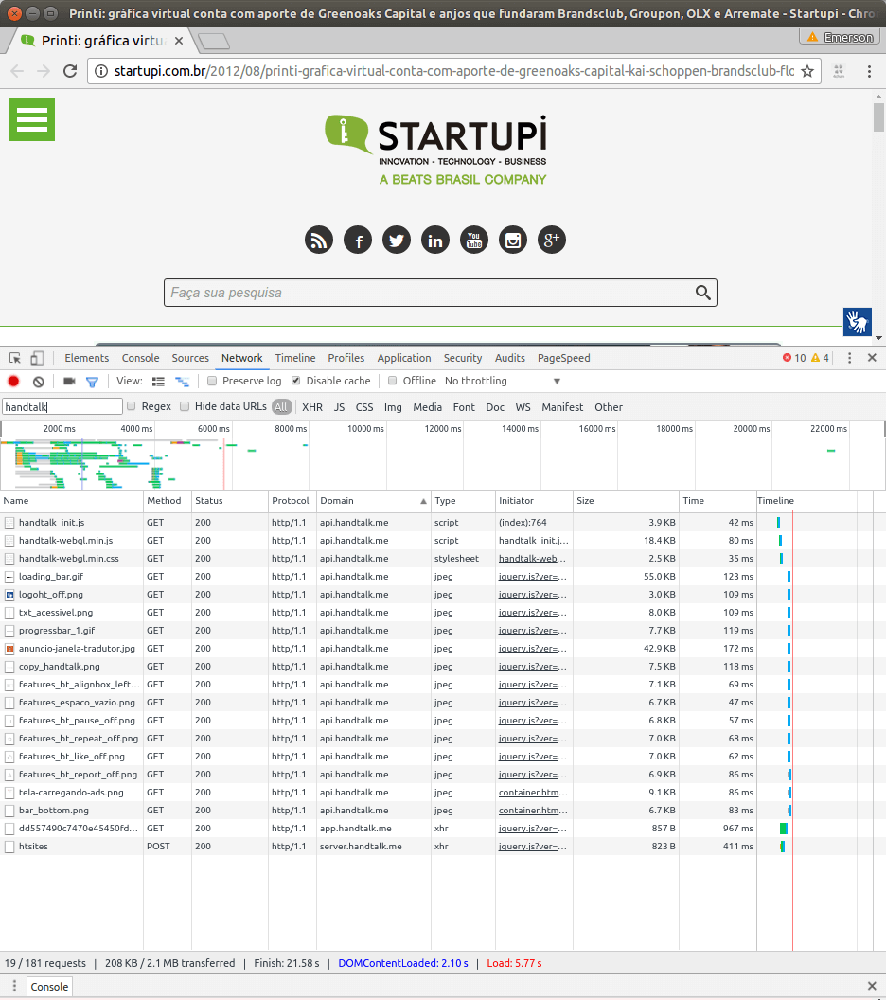
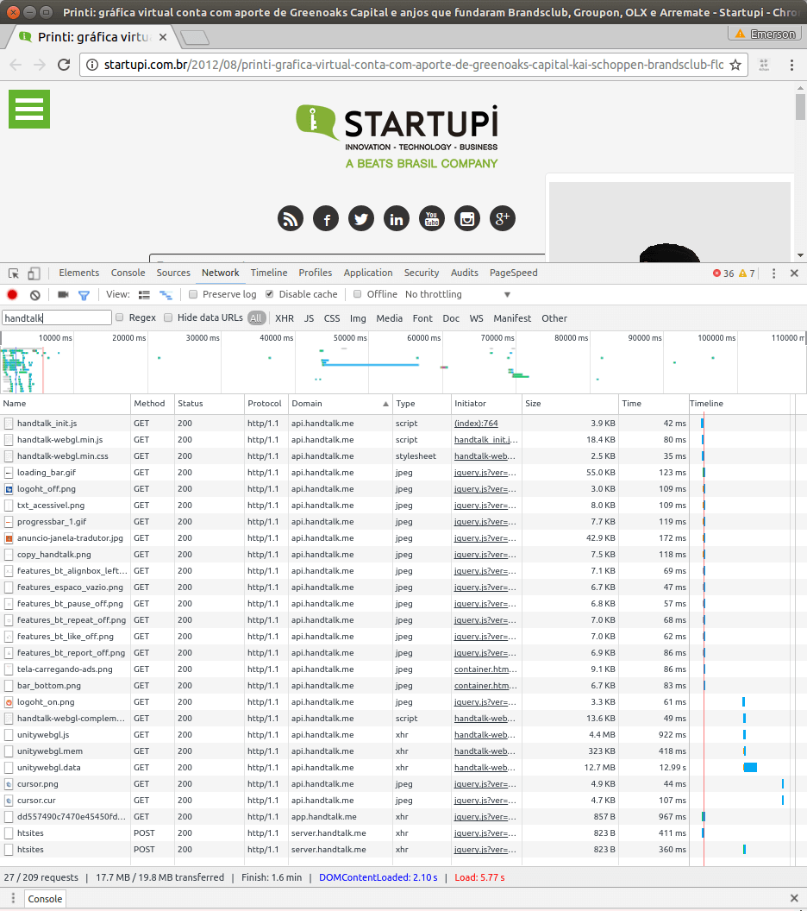

# Criticas quando ao plugin web do HandTalk.me

As informações aqui são críticas da a forma como o script do [HandTalk.me](http://www.handtalk.me/)
é incluso em sites, não é sobre o aplicativo móvel e são válidas para a data
em que isto é escrito. Teve origem na discussão [Sites acessiveis para surdos, com conteudo em libras](https://github.com/frontendbr/forum/issues/210).

Explicitamente, isto **não** critica a qualidade do serviço final

**TL;DR:**:

- **Você NÃO fere lei por não incluir este script proprietário**, ao contrário
do que o site poderia deixar subentendido
- **Deixa o site mais lento**: 208KB de arquivos para uma uma funcionalidade que
raramente vai ser usada. Note: não tenho críticas a 19MB necessário quando a solução
é usada
- **Requer JavaScript e extrema confiança nos sites que os usam**: ao requerer
JavaScript na mesma janela (não iframes) por padrão, isso dá completo poder sobre
o que ocorre, não apenas para surdos
- **Os termos de uso abrem margem para uso para fins comerciais se a empresa for
comprada**, o combo muitos sites usando a versão gratuita e o poder de
rastreamento tornaria esse projeto altamente interessante para análise de
concorrência.
- **Uma forma de mitigar essas críticas é carregar script dos servidores do
HandTalk apenas quando for efetivamente necessário**

## Do que esse feedback não trata
Esse feedback não aborda qualquer ponto quanto a qualidade do serviço final
propriamente dito. Não tenho experiência na área para comentários positivos
ou de pontos de melhoria sobre o serviço em si.

# Dos pontos de melhoria

_Nota: boa parte desses pontos não tem como serem resolvidos porque dependem
disso para a aplicação web funcionar. O ideal seria, no mínimo, que pessoas
tenham opção de só carregar JavaScript e dar poder ao Hand Talk se algum
link for clicado, ou mesmo que o HandTalk seja uma extensão para navegador,
não algo a ser adicionado por padrão em todos os sites._

## Apelo à autoridade

De http://www.handtalk.me/sobre#lbi:

> "Art. 63. É obrigatória a acessibilidade nos sítios da internet  mantidos por empresas com sede ou representação comercial no País ou por órgãos de governo, para uso da pessoa com deficiência, garantindo-lhe acesso às informações disponíveis, conforme as melhores práticas e diretrizes de acessibilidade adotadas internacionalmente."

Dos principais motivos que me levaram a escrever isso, ao contrário de boas
práticas, como uso das WCAG, a inclusão de scripts proprietários NÃO é um
requerimento para cumprir legislação brasileira.

Notem essa notícia em http://tce-rs.jusbrasil.com.br/noticias/294595254/tce-rs-disponibiliza-ferramenta-de-acessibilidade-hand-talk

> A partir desta sexta-feira (08), o Tribunal de Contas do Estado (TCE-RS) conta com o Hand Talk, uma nova ferramenta de tradução digital para a Língua Brasileira de Sinais (Líbras). (...) Entre as vantagens do aplicativo, está a inclusão e o cumprimento da Lei nº 10.436 e do Decreto nº 186, que determinam que empresas públicas e privadas devem oferecer acessibilidade em Líbras.

Repito: **em nenhum lugar sério do mundo é aceito como boa prática de
acessibilidade uso de ferramenta proprietária**. Não importa quantos prêmios
ganhe, mesmo que tenha sido eleito em algum momento como _um ótimo aplicativo_
isso não torna seu uso uma recomendação técnica.

Recomendações técnicas são avaliadas por dezenas, ou centenas, de profissionais
de diferentes instituições. E o HandTalk é uma ferramenta, não um padrão de
desenvolvimento.

Eu fortemente não recomendo que uso de tal solução sequer seja considerada como
vantagem extra para ser visto como "site acessível" em premiações como
o Todos@Web. Tal endorsamento implicaria em forma implicita de vantagem
estatal a empresa privada. E mesmo que o HandTalk ainda fosse estatal, ainda
seria um problema, porque ainda exige servidores dos quais desenvolvedores web
não tem pleno poder de controle.

Veja também a [Carta aberta ao Prêmio Nacional de Acessibilidade na Web](https://github.com/fititnt/carta-aberta-premio-nacional-acessibilidade-na-web).

## O uso do script deixa o site mais lento, e gasta mais banda de TODOS os visitantes

Um site aleatório com o script, mesmo para quem não usa o HandTalk, gasta incríveis
208KB:

A título de comparação, outra tela exibindo quando é gasto no primeiro
carregamento do HandTalk: 17.7MB. Notem, porém, que não tenho tenho argumentos
fortes para críticar esse tamanho, também porque para usuários frequentes, é
provável que apenas o primeiro carregamento, mesmo entre sites diferentes, iria
dispender isto.

## Obrigatoriedade de Uso de JavaScript: muito poder por padrão
Ao incluir JavaScript na _mesma janela_ e nao em um `iframe`, isso dá completo
poder. Isso é equivalente a [Cross-site scripting](https://pt.wikipedia.org/wiki/Cross-site_scripting)
e a garantia de não ocorrer é de que o servidor original não seja comprometido
(por exemplo, ocorra uma invasão) e também por questões políticas.

Não, uso de HTTPS não resolve esse problema. Isso evita que pessoas além da
HandTalk.me não alterem conteúdo, porém não evita que o proprio HandTalk.me
deixe de fazer rastreamento ou mesmo, de forma intensional ou por invasão,
possa ser usado para tomar controle dos sites em que tem acesso.

Não por acaso o site tem até uma resposta a uma pergunta frequênte [que explica
não ser possível adicionar seu plugin em sites do WIX](http://suporte.handtalk.me/hc/pt-br/articles/218408658-Meu-site-foi-feito-na-plataforma-WIX-Posso-colocar-o-Hand-Talk-nele-).

## Dos termos de uso, possibilidade de usar dados para fins adversos

Não consegui achar o termo de uso exato para script inforporado via web. O mais
próximo que encontrei foi o [Termos de Uso do Aplicativo Hand Talk](http://suporte.handtalk.me/hc/pt-br/articles/218403418-Termos-de-Uso-do-Aplicativo-Hand-Talk).

> 5 Coleta e tratamento de informações
>
> As informações coletadas através do aplicativo são utilizadas exclusivamente pela Hand Talk para auxiliar na otimização da qualidade do serviço prestado. Elas são analisadas para determinar o que é mais eficaz no aplicativo, para identificar meios de melhorá-lo e determinar como customizá-lo para atender a demanda dos usuários. Os dados, também poderão ser utilizados para outros fins de pesquisas e estudos para futuras aplicações da Hand Talk.

É comum termos de uso, em especial de aplicações via Web, deixarem claro com
quem compartilham informações. Isto não fica claro nesse termo de uso.
Idealmente deveriam deixar claro se pode ou não ser compartilhado com parceiros.

Ainda assim, assumindo que não compartilham com terceiros, ou que terceiros
"digam que vão usar informações para melhorar o HandTalk, mas também usem
os dados para outros fins" um risco que eu
pessoalmente alertaria a todos aqui é: **e se a empresa for comprada?**

> 1 Condições de Uso
> 
> Os termos aqui descritos são aplicados somente ao aplicativo Hand Talk.
Alterações ou correções poderam ser realizadas nos termos de uso, e caso aconteça, você será notificado. Concordando com as mudanças, você poderá continuar usufruindo normalmente o serviço.

Do comentário do Fundador em https://github.com/frontendbr/forum/issues/210#issuecomment-255768269

> ThadeuLuz commented 6 hours ago • edited
> Aviso: sou um dos fundadores da Hand Talk
> 
> Acho que devemos fazer um trabalho melhor na comunicação sobre como funciona a propaganda. Peço desculpas por não termos feito isso inicialmente.
> 
> A 'propaganda' é só uma imagem com um link para uma página sempre em algum domínio nosso (handtalk.me ou amigodosurdo.com), mostrada enquanto o plugin abre. Não tem javascript de terceiros pra rede de afiliados ou coisa do tipo. **Até as do Uber que vc vê hoje, são links para posts no nosso blog**. O único JavaScript de terceiros que usamos é o gerado pelo Unity 3D, que é nosso engine pra webGL.
> 
> Nesse link tem mais informações sobre segurança. Somos um time pequeno, mas estamos considerando a possibilidade de abrir o código fonte do tradutor de sites.

Num primeiro momento, eu não tinha parado para pensar nisso, mas ao ler "Até as
do Uber que vc vê hoje, são links para posts no nosso blog" isso me deu um
receio: e se a empresa, mesmo que a médio prazo, não for lucrativa? O que
acontece se, mesmo com sucesso de ser usada por centenas de sites, porém
mesmo para sites grandes, o uso for baixo a ponto de não ser economicamente
viável?

Neste caso, existe um tipo de empresa que adoraria comprar o HandTalk.me: as
interessadas em saber informações sobre concorrência. Mesmo que uma empresa
compre o HandTalk e não use para, por exemplo, aproveitar do total controle
que inclusão de JavaScript dá para até mesmo saber dados de login, tal empresa
resolva apenas aproveitar informações coletadas, isso sozinho já tem um valor
enorme.

Creio que semanas atrás, eu vi até mesmo o script do HandTalk ser inclído em
sites de grande acesso, como o Catraca Livre.

# Proposta de melhoria

Uma forma de reduzir as críticas afirmadas aqui é relativamente simples:
**apenas após interação de usuário, arquivos JavaScript, CSS e imagens poderiam
ser carregado dos servidores do HandTalk.** Isto reduziria severamente o risco
de privacidade e coleta de dados, bem como representaria um enorme ganho de
velocidade em sites atuais.

Esta alteração é mais complexa do que o "copiar e colar" oferecido no site
como método de instalação, porém resolve maior parte das críticas aqui. Isto
também reduz a atratividade da empresa em ser comprada por terceiros
interessados no potencial de informação que ela pode ter mesmo com o plugin
na versão gratúita.

## Direitos de cópia - DMCA Fair Use

Eu não possuo qualquer relação com HandTalk.me, ou qualquer marca envolvida. As
informações aqui são comentários de carater educacional e de críticas, sem
interesse comercial. Sabia mais em https://www.dmca.com/FAQ/Fair-Use.